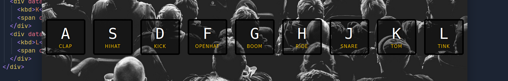

# JavaScript Drum Kit

## Live Demo

Check out the live demo here: [JavaScript Drum Kit](https://srtrace.github.io/js_drum_kit/)

A simple and interactive web page that plays drum sounds controlled by keyboard keys. The project features a beautiful design achieved with CSS and dynamic functionality using JavaScript.

## Features

- **Keyboard Controls:** Press specific keys to trigger corresponding drum sounds.
- **Stylish Interface:** Clean and attractive visuals created using CSS.
- **Simple and Lightweight:** Built with vanilla JavaScript and minimal dependencies.

## How to Use

1. Clone the repository or download the files.
2. Open the `index.html` file in a web browser.
3. Use your keyboard to play the drum sounds. Each key is mapped to a specific sound.

Enjoy playing with your own virtual drum kit!
